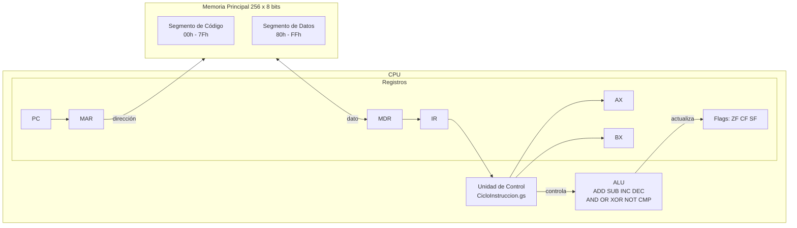

# Simulador de CPU — Arquitectura von Neumann / x86 de 8 bits

**Materia:** Arquitectura de Computadoras (SIS-131) · **Evaluación:** Primer Parcial
**Plataforma elegida (Opción B):** Google Sheets + Google Apps Script (JavaScript)

Simulador interactivo y visual del ciclo completo de instrucción
(Fetch → Decode → Execute → Store) y de la gestión de la Memoria Principal,
construido sobre una hoja de cálculo.

---

## 1. Arquitectura del sistema



**Diseño modular** (pensado para el Parcial 2 — bus multiplexado, I/O e
interrupciones): cada componente es un módulo independiente en `src/`:

| Módulo | Responsabilidad |
|---|---|
| `Memoria.gs` | RAM de 256 bytes; primitivas `Read(address)` / `Write(address, value)` |
| `Registros.gs` | PC, IR, MAR, MDR, AX, BX y banderas ZF/CF/SF |
| `ALU.gs` | Operaciones aritméticas y lógicas de 8 bits + banderas |
| `ISA.gs` | Tabla de opcodes del set de instrucciones |
| `Ensamblador.gs` | Traductor de mnemónicos a código máquina (2 pasadas, con etiquetas) |
| `CicloInstruccion.gs` | Unidad de Control: Fetch, Decode, Execute, Store |
| `Controles.gs` | STEP, RUN, PAUSE, RESET, LOAD PROGRAM |
| `Interfaz.gs` | Matriz 16×16, panel de registros, resaltado en tiempo real |
| `LogMicroOps.gs` | Log cronológico de micro-operaciones |
| `ProgramaDemo.gs` | Programa demostrativo (multiplicación por sumas sucesivas) |

## 2. Memoria

- **256 posiciones** continuas de **8 bits**, direcciones `00h` a `FFh`.
- Vista en **matriz 16×16** con encabezados hexadecimales de fila y columna.
- Cada celda se puede inspeccionar en **HEX**, **BIN** o **DEC** (selector `VISTA`).
- **Segmentación lógica:** `00h–7Fh` Segmento de Código (azul) y `80h–FFh`
  Segmento de Datos (verde).
- Acceso exclusivo por las subrutinas `memRead(direccion)` y
  `memWrite(direccion, valor)`, con validación de rango.

## 3. Tabla de la ISA

Codificación: 1 byte de opcode + 0/1 byte de operando (`imm` = inmediato,
`dir` = dirección de memoria).

| Opcode | Instrucción | Bytes | Descripción |
|:---:|---|:---:|---|
| `10` | `MOV AX, imm` | 2 | AX ← inmediato |
| `11` | `MOV BX, imm` | 2 | BX ← inmediato |
| `12` | `MOV AX, BX` | 1 | AX ← BX |
| `13` | `MOV BX, AX` | 1 | BX ← AX |
| `20` | `LOAD AX, [dir]` | 2 | AX ← RAM[dir] |
| `21` | `LOAD BX, [dir]` | 2 | BX ← RAM[dir] |
| `30` | `STORE [dir], AX` | 2 | RAM[dir] ← AX (vía MDR → RAM[MAR]) |
| `31` | `STORE [dir], BX` | 2 | RAM[dir] ← BX |
| `40`/`41` | `ADD AX, imm/BX` | 2/1 | AX ← AX + op; actualiza ZF CF SF |
| `42`/`43` | `ADD BX, imm/AX` | 2/1 | BX ← BX + op |
| `50`/`51` | `SUB AX, imm/BX` | 2/1 | AX ← AX − op |
| `52`/`53` | `SUB BX, imm/AX` | 2/1 | BX ← BX − op |
| `60` / `61` | `INC AX` / `INC BX` | 1 | registro + 1 |
| `62` / `63` | `DEC AX` / `DEC BX` | 1 | registro − 1 |
| `70`/`71` | `CMP AX, imm/BX` | 2/1 | banderas de AX − op (no guarda) |
| `72`/`73` | `CMP BX, imm/AX` | 2/1 | banderas de BX − op (no guarda) |
| `80`–`83` | `AND reg, imm/reg` | 2/1 | AND lógico |
| `90`–`93` | `OR reg, imm/reg` | 2/1 | OR lógico |
| `A0`–`A3` | `XOR reg, imm/reg` | 2/1 | XOR lógico |
| `B0` / `B1` | `NOT AX` / `NOT BX` | 1 | complemento a 1 |
| `C0` | `JMP dir` | 2 | PC ← dir (incondicional) |
| `C1` | `JZ dir` | 2 | salta si ZF = 1 |
| `C2` | `JNZ dir` | 2 | salta si ZF = 0 |
| `FF` | `HLT` | 1 | detiene el reloj |

## 4. Ciclo de instrucción (4 fases)

1. **FETCH:** `PC → MAR`; `RAM[MAR] → MDR`; `MDR → IR`; `PC ← PC + 1`.
2. **DECODE:** la Unidad de Control interpreta el opcode del IR, identifica el
   modo de direccionamiento y busca el byte de operando si la instrucción es
   de 2 bytes.
3. **EXECUTE:** la ALU opera (actualizando ZF/CF/SF) o se resuelve la
   bifurcación condicional/incondicional.
4. **STORE:** write-back del resultado al registro destino o `MDR → RAM[MAR]`.

Cada fase queda registrada en la hoja **Log** con el formato
`[Paso 08] FETCH: MAR=0x12, MDR=0x05 → IR=...`.

## 5. Manual de usuario

### Instalación
1. Crear una hoja de cálculo nueva en Google Sheets.
2. Abrir **Extensiones → Apps Script** y copiar cada archivo de `src/`
   (los `.gs`) en el editor. Guardar.
3. Recargar la hoja: aparece el menú **▶ Simulador CPU**.
4. Ejecutar **▶ Simulador CPU → Construir interfaz** (autorizar permisos la
   primera vez).

### Uso paso a paso
1. **Cargar un programa:** escribirlo en la hoja `Programa` (una instrucción
   por línea) y usar **LOAD PROGRAM**, o ejecutar
   **Cargar programa demostrativo**.
2. **STEP:** avanza una fase del ciclo; el registro y la celda de memoria
   activos se resaltan en amarillo y la fase actual se muestra en `FASE`.
3. **RUN:** ejecución continua; el retardo entre fases se ajusta en
   `DELAY (ms)`. **PAUSE** detiene sin corromper el estado.
4. **RESET:** registros, banderas y log a cero (la RAM conserva el programa).
5. **VISTA:** cambia la representación de la memoria entre HEX, BIN y DEC
   (menú *Refrescar vista de memoria* tras cambiarla).
6. Los botones dibujados en la hoja pueden asignarse a las funciones
   `btnStep`, `btnRun`, `btnPause`, `btnReset`, `btnLoadProgram`
   (clic derecho sobre el dibujo → *Asignar secuencia de comandos*).

## 6. Programa demostrativo: 6 × 4 por sumas sucesivas

```asm
        MOV AX, 0        ; acumulador del resultado
        MOV BX, 4        ; contador de repeticiones
bucle:  CMP BX, 0        ; ¿contador == 0?
        JZ fin           ; si ZF=1, terminar
        ADD AX, 6        ; AX = AX + 6
        DEC BX           ; BX = BX - 1
        JMP bucle        ; repetir
fin:    STORE [0x80], AX ; resultado al Segmento de Datos
        HLT
```

**Código máquina generado (Segmento de Código):**
`10 00 | 11 04 | 72 00 | C1 0D | 40 06 | 63 | C0 04 | 30 80 | FF`

### Traza de registros

| # | Instrucción | AX | BX | ZF | CF | SF | PC final |
|---|---|:--:|:--:|:--:|:--:|:--:|:--:|
| 1 | `MOV AX, 0` | 0x00 | — | 0 | 0 | 0 | 0x02 |
| 2 | `MOV BX, 4` | 0x00 | 0x04 | 0 | 0 | 0 | 0x04 |
| 3 | `CMP BX, 0` (4−0=4) | 0x00 | 0x04 | 0 | 0 | 0 | 0x06 |
| 4 | `JZ 0x0D` (no salta) | 0x00 | 0x04 | 0 | 0 | 0 | 0x08 |
| 5 | `ADD AX, 6` | 0x06 | 0x04 | 0 | 0 | 0 | 0x0A |
| 6 | `DEC BX` | 0x06 | 0x03 | 0 | 0 | 0 | 0x0B |
| 7 | `JMP 0x04` | 0x06 | 0x03 | 0 | 0 | 0 | 0x04 |
| … | *(3 iteraciones más del bucle)* | 0x0C→0x12→0x18 | 0x02→0x01→0x00 | | | | |
| 20 | `CMP BX, 0` (0−0=0) | 0x18 | 0x00 | **1** | 0 | 0 | 0x06 |
| 21 | `JZ 0x0D` (**salta**, ZF=1) | 0x18 | 0x00 | 1 | 0 | 0 | 0x0D |
| 22 | `STORE [0x80], AX` | 0x18 | 0x00 | 1 | 0 | 0 | 0x0F |
| 23 | `HLT` | 0x18 | 0x00 | 1 | 0 | 0 | 0x10 |

**Resultado:** `RAM[80h] = 0x18 = 24d` ✔ (6 × 4), visible en la primera celda
del Segmento de Datos.

## 7. Gestión del proyecto

- Tablero Kanban en GitHub Projects con columnas *Backlog / To Do /
  In Progress / In Review-Testing / Done* — ver [`docs/KANBAN.md`](docs/KANBAN.md).
- Issues #1–#19 con criterios de aceptación por tarjeta.
- Commits semánticos (`feat:`, `fix:`, `docs:`, `refactor:`).
