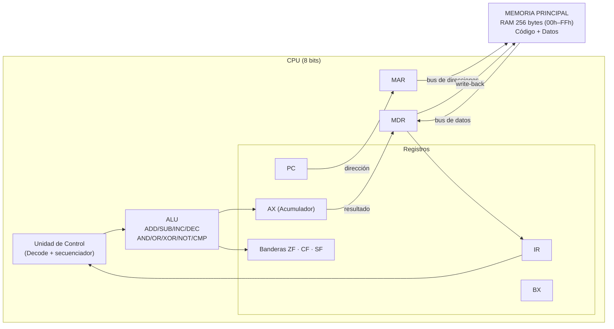
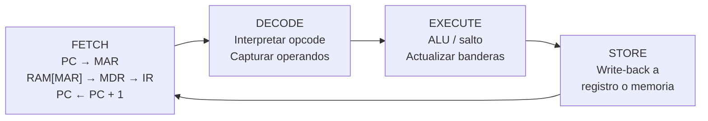

# Simulador de CPU — Arquitectura von Neumann / x86 de 8 bits

Simulador interactivo y visual del **ciclo completo de instrucción** (Fetch → Decode →
Execute → Store) y de la **gestión de memoria** de un procesador de 8 bits, desarrollado
en **Microsoft Excel + VBA** (Visual Basic for Applications).

El simulador modela el núcleo de procesamiento (ALU, registros y Unidad de Control) y una
memoria principal (RAM) de 256 bytes, con ejecución **paso a paso** y **continua**,
resaltado visual del flujo en tiempo real y un log cronológico de micro-operaciones.

> **Materia:** Arquitectura de Computadoras (SIS-131) — Ingeniería de Software — UCB Santa Cruz
> **Evaluación:** Primer Parcial — Proyecto práctico y defensa oral.

---

## Índice

1. [Características](#características)
2. [Arquitectura del sistema](#arquitectura-del-sistema)
3. [Mapa de memoria](#mapa-de-memoria)
4. [Registros y banderas](#registros-y-banderas)
5. [Conjunto de instrucciones (ISA)](#conjunto-de-instrucciones-isa)
6. [Ciclo de instrucción](#ciclo-de-instrucción)
7. [Estructura del proyecto](#estructura-del-proyecto)
8. [Instalación y puesta en marcha](#instalación-y-puesta-en-marcha)
9. [Manual de usuario](#manual-de-usuario)
10. [Programa demostrativo y traza](#programa-demostrativo-y-traza)

---

## Características

- **Memoria RAM de 256 bytes** direccionable de `00h` a `FFh`, presentada como matriz
  16×16 con segmentación visual entre **código** (azul) y **datos** (gris).
- **Registros visibles**: `PC`, `IR`, `MAR`, `MDR`, `AX` (Acumulador) y `BX`.
- **Registro de estado** con banderas `ZF` (Zero), `CF` (Carry) y `SF` (Sign).
- **ALU** de 8 bits con operaciones aritméticas y lógicas (`ADD`, `SUB`, `INC`, `DEC`,
  `AND`, `OR`, `XOR`, `NOT`, `CMP`).
- **Ciclo de instrucción de 4 fases** descompuesto explícitamente (Fetch, Decode,
  Execute, Store), avanzable micro-operación a micro-operación.
- **Modo Paso a Paso** (STEP) y **Modo Continuo** (RUN) con retardo ajustable y PAUSE.
- **Resaltado en tiempo real** de la celda de memoria activa (MAR) y de la instrucción
  apuntada por el PC.
- **Log cronológico** de micro-operaciones numeradas.
- **Ensamblador de dos pasadas** con soporte de etiquetas, comentarios e inmediatos en
  decimal y hexadecimal (`0x20`, `20h`).

---

## Arquitectura del sistema

Arquitectura de **von Neumann**: memoria única compartida para instrucciones y datos,
conectada a la CPU a través de los registros de interfaz `MAR` / `MDR`.



---

## Mapa de memoria

La RAM se organiza como una cuadrícula de 16×16 celdas de 1 byte. La dirección de cada
celda se forma con el **nibble alto** (fila) y el **nibble bajo** (columna).

| Segmento | Rango típico | Uso |
|---|---|---|
| **Código** | `00h` … (fin del programa) | Instrucciones cargadas por `LOAD PROGRAM` |
| **Datos**  | resto hasta `FFh`          | Variables y resultados (p. ej. `RAM[20h]`) |

El simulador colorea automáticamente el segmento de código en **azul** y el de datos en
**gris**, resaltando en **amarillo** la celda direccionada por `MAR` y en **verde** la
instrucción apuntada por `PC`.

---

## Registros y banderas

| Registro | Ancho | Función |
|---|---|---|
| `PC`  | 8 bits | *Program Counter*: dirección de la siguiente instrucción. |
| `IR`  | 8 bits | *Instruction Register*: opcode de la instrucción en curso. |
| `MAR` | 8 bits | *Memory Address Register*: dirección a leer/escribir. |
| `MDR` | 8 bits | *Memory Data Register*: dato transferido con la RAM. |
| `AX`  | 8 bits | Acumulador de propósito general (cómputo aritmético). |
| `BX`  | 8 bits | Registro de propósito general. |

| Bandera | Se activa (=1) cuando… |
|---|---|
| `ZF` (Zero)  | el resultado de la última operación de la ALU fue `00h`. |
| `CF` (Carry) | hubo acarreo (suma) o préstamo (resta) sin signo. |
| `SF` (Sign)  | el bit más significativo (MSB) del resultado es 1 (negativo en Ca2). |

---

## Conjunto de instrucciones (ISA)

Codificación de registros: `AX = 00h`, `BX = 01h`. Los inmediatos y direcciones ocupan
1 byte. La tabla es la fuente formal de opcodes del procesador.

| Opcode | Mnemónico | Bytes | Sintaxis | Descripción | Banderas |
|:---:|:---|:---:|:---|:---|:---:|
| `00h` | NOP   | 1 | `NOP`              | No realiza operación. | — |
| `10h` | MOV   | 3 | `MOV reg, imm`     | Carga un inmediato en el registro. | — |
| `11h` | MOV   | 3 | `MOV reg, reg`     | Copia registro a registro. | — |
| `20h` | LOAD  | 3 | `LOAD reg, [dir]`  | Carga en el registro el dato de memoria. | — |
| `21h` | STORE | 3 | `STORE [dir], reg` | Guarda el registro en memoria. | — |
| `30h` | ADD   | 3 | `ADD reg, imm`     | `reg ← reg + imm`. | ZF·CF·SF |
| `31h` | ADD   | 3 | `ADD reg, reg`     | `reg ← reg + reg`. | ZF·CF·SF |
| `32h` | SUB   | 3 | `SUB reg, imm`     | `reg ← reg − imm`. | ZF·CF·SF |
| `33h` | SUB   | 3 | `SUB reg, reg`     | `reg ← reg − reg`. | ZF·CF·SF |
| `34h` | INC   | 2 | `INC reg`          | `reg ← reg + 1`. | ZF·CF·SF |
| `35h` | DEC   | 2 | `DEC reg`          | `reg ← reg − 1`. | ZF·CF·SF |
| `36h` | CMP   | 3 | `CMP reg, imm`     | Compara (`reg − imm`) y fija banderas. | ZF·CF·SF |
| `37h` | CMP   | 3 | `CMP reg, reg`     | Compara (`reg − reg`) y fija banderas. | ZF·CF·SF |
| `40h` | AND   | 3 | `AND reg, reg`     | `reg ← reg AND reg`. | ZF·SF |
| `41h` | OR    | 3 | `OR reg, reg`      | `reg ← reg OR reg`. | ZF·SF |
| `42h` | XOR   | 3 | `XOR reg, reg`     | `reg ← reg XOR reg`. | ZF·SF |
| `43h` | NOT   | 2 | `NOT reg`          | `reg ← NOT reg` (complemento a 1). | ZF·SF |
| `50h` | JMP   | 2 | `JMP dir`          | Salto incondicional a `dir`. | — |
| `51h` | JZ    | 2 | `JZ dir`           | Salta a `dir` si `ZF = 1`. | — |
| `52h` | JNZ   | 2 | `JNZ dir`          | Salta a `dir` si `ZF = 0`. | — |
| `FFh` | HLT   | 1 | `HLT`              | Detiene el reloj de la CPU. | — |

---

## Ciclo de instrucción

Cada instrucción se descompone en cuatro fases del ciclo de reloj. En modo Paso a Paso
cada clic de **STEP** avanza exactamente una fase.



---

## Estructura del proyecto

El código está organizado en módulos desacoplados (diseño modular y escalable de cara al
Segundo Parcial: Buses e I/O).

```
src/
├── modEstado.bas        Constantes de arquitectura y control del motor de ejecución
├── modMemoria.bas       RAM de 256 bytes y primitivas Read/Write
├── modRegistros.bas     Banco de registros visibles y banderas ZF/CF/SF
├── modISA.bas           Tabla de opcodes, tamaños y mnemónicos
├── modALU.bas           Unidad Aritmético-Lógica
├── modCiclo.bas         Ciclo Fetch-Decode-Execute-Store (Unidad de Control)
├── modEnsamblador.bas   Ensamblador de dos pasadas y cargador LOAD PROGRAM
├── modInterfaz.bas      Construcción de la hoja, cuadrícula y resaltado
├── modControles.bas     Botones STEP / RUN / PAUSE / RESET / LOAD
├── modLog.bas           Log cronológico de micro-operaciones
└── modPrograma.bas      Programa demostrativo (multiplicación por sumas)
docs/
└── KANBAN.md            Desglose de tareas del tablero Kanban
```

---

## Instalación y puesta en marcha

> Requiere Microsoft Excel con macros habilitadas (formato `.xlsm`).

1. Abrir un libro nuevo de Excel y guardarlo como **Libro habilitado para macros (`.xlsm`)**.
2. Abrir el editor de VBA con **`Alt + F11`**.
3. En **Archivo → Importar archivo…**, importar los **11 módulos** de la carpeta `src/`
   (los archivos `.bas`).
4. Habilitar el modelo de objetos si se pide (Archivo → Opciones → Centro de confianza →
   Configuración de macros).
5. Ejecutar la macro **`ConstruirSimulador`** (`Alt + F8` → seleccionar → *Ejecutar*).
   Se genera automáticamente la hoja *Simulador* con la cuadrícula de memoria, el panel de
   registros y los botones de control.
6. Guardar el libro. ¡Listo para la demostración!

---

## Manual de usuario

Una vez construida la hoja *Simulador*, la operación se realiza con cinco botones:

| Botón | Acción |
|---|---|
| **LOAD PROGRAM** | Ensambla y carga el programa demostrativo en la memoria (desde `00h`). |
| **STEP** | Avanza **una micro-operación** (una fase del ciclo). Ideal para la defensa. |
| **RUN** | Ejecuta de forma continua hasta `HLT`, con el retardo (ms) indicado en la hoja. |
| **PAUSE** | Detiene la ejecución continua sin perder el estado. |
| **RESET** | Restaura registros, banderas y `PC` a `00h`, conservando el programa cargado. |

**Flujo recomendado para la demostración:**

1. Pulsar **LOAD PROGRAM**.
2. Pulsar **STEP** repetidamente y observar cómo:
   - en *Fetch* el `MAR` toma el valor del `PC` y la celda activa se resalta en amarillo;
   - en *Decode* el `IR` muestra el mnemónico de la instrucción;
   - en *Execute* cambian `AX`/`BX` y las banderas;
   - en *Store* se escribe el resultado en el registro o en memoria.
3. Alternativamente, pulsar **RUN** para ver la animación completa y **PAUSE** para
   congelar el flujo.
4. El **log** de la derecha registra cada micro-operación numerada.

Para modificar en vivo un dato de memoria (típico en la ronda de preguntas), basta con
escribir un nuevo valor hexadecimal en cualquier celda del segmento de datos.

---

## Programa demostrativo y traza

El programa obligatorio calcula **3 × 4 = 12** mediante **sumas sucesivas** (bucle con
bifurcación condicional) y guarda el resultado en el segmento de datos `RAM[20h]`.

```asm
; ============================================================
; Multiplicación por sumas sucesivas: 3 x 4 = 12 (0Ch)
;   AX = acumulador (resultado)   BX = contador (multiplicador)
; ============================================================
        MOV AX, 0        ; AX = 0  (resultado)
        MOV BX, 4        ; BX = 4  (multiplicador / contador)
LOOP:   CMP BX, 0        ; contador == 0 ?
        JZ  FIN          ; si es cero, terminar
        ADD AX, 3        ; resultado += 3  (multiplicando)
        DEC BX           ; contador--
        JMP LOOP         ; repetir el bucle
FIN:    STORE [0x20], AX ; guardar resultado en RAM[20h]
        HLT              ; detener el reloj
```

**Código máquina generado (22 bytes, desde `00h`):**

```
10 00 00 10 01 04 36 01 00 51 12 30 00 03 35 01 50 06 21 20 00 FF
```

Etiquetas resueltas por el ensamblador: `LOOP = 06h`, `FIN = 12h`.

**Traza de ejecución (por instrucción).** El bucle se repite 4 veces; en cada vuelta `AX`
crece en 3 y `BX` decrece en 1 hasta que `CMP BX, 0` activa `ZF` y `JZ` salta al final:

| #  | PC  | Instrucción      | AX | BX | ZF | CF | SF |
|---:|----:|------------------|---:|---:|:--:|:--:|:--:|
| 1  | 00h | MOV AX, 00h      |  0 |  0 | 0 | 0 | 0 |
| 2  | 03h | MOV BX, 04h      |  0 |  4 | 0 | 0 | 0 |
| 3  | 06h | CMP BX, 00h      |  0 |  4 | 0 | 0 | 0 |
| 4  | 09h | JZ 12h           |  0 |  4 | 0 | 0 | 0 |
| 5  | 0Bh | ADD AX, 03h      |  3 |  4 | 0 | 0 | 0 |
| 6  | 0Eh | DEC BX           |  3 |  3 | 0 | 0 | 0 |
| 7  | 10h | JMP 06h          |  3 |  3 | 0 | 0 | 0 |
| 8  | 06h | CMP BX, 00h      |  3 |  3 | 0 | 0 | 0 |
| …  | …   | *(2.ª vuelta)*   |  6 |  2 | 0 | 0 | 0 |
| …  | …   | *(3.ª vuelta)*   |  9 |  1 | 0 | 0 | 0 |
| 20 | 0Bh | ADD AX, 03h      | 12 |  1 | 0 | 0 | 0 |
| 21 | 0Eh | DEC BX           | 12 |  0 | **1** | 0 | 0 |
| 23 | 06h | CMP BX, 00h      | 12 |  0 | **1** | 0 | 0 |
| 24 | 09h | JZ 12h → salta   | 12 |  0 | **1** | 0 | 0 |
| 25 | 12h | STORE [20h], AX  | 12 |  0 | 1 | 0 | 0 |
| 26 | 15h | HLT              | 12 |  0 | 1 | 0 | 0 |

**Resultado final:** `AX = 0Ch (12)`, `RAM[20h] = 0Ch (12)`, `ZF = 1`. La CPU se detiene
al ejecutar `HLT`.
